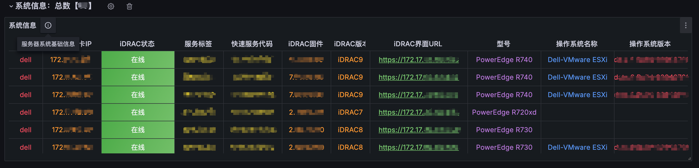
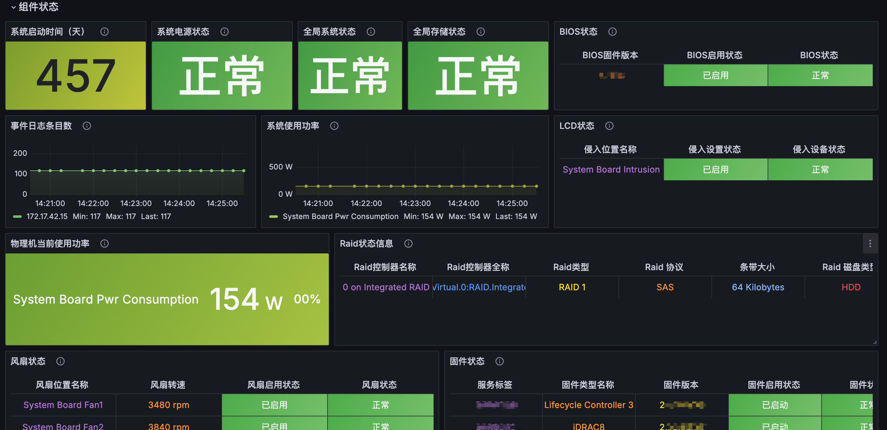
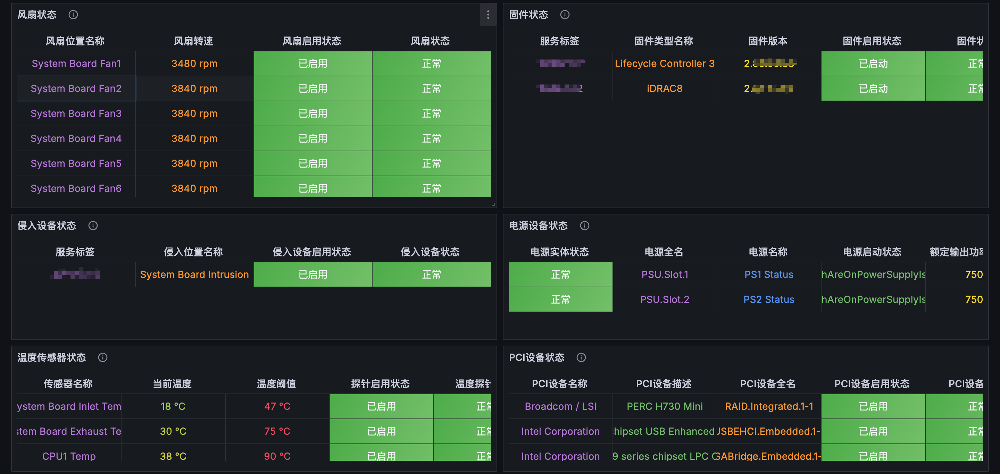
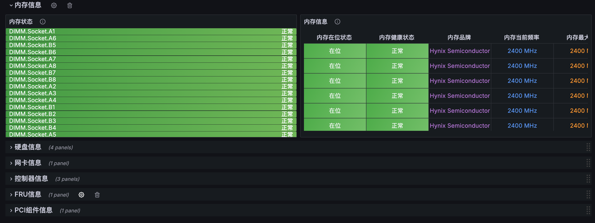

## 最全面的 iDRAC Grafana Dashboard（持续更新中）
💻📊🔥✅
基于 **`SNMP`** 协议的监控戴尔物理机 **`iDRAC`** 信息的 **`Grafana`** 面板。

Grafana Dashboard ID: 12106

面板详细：

👉👉👉更多面板信息请套用后反馈一些意见。

### 当前特性
- 添加一个全局系统信息行，系统信息行中通过模版变量显示当前采集物理机的总数
- 系统信息表中采集每个服务器的 **`iDRAC URL`** ，可直接在面板中点击链接登录 **`iDRAC`**
- 对应物理服务器全局状态信息可根据模版变量选择主机IP实现对物理机全局状态的查看
- 面板和单元格会根据实际状态信息改变对应状态颜色，以提示状态异常组件问题
- 仪表板中每台物理机信息都会显示以下数据：
    - 系统运行时间、全局状态、系统电源状态、BIOS状态、PSU 状态、CMOS 电池状态、存储状态
    - 服务标签、快速服务代码、BIOS 版本、操作系统名称、操作系统版本、服务器型号等等
    - 物理机当前使用功率图
    - CPU 温度表（可自行更改为CPU温度趋势图）
    - 系统内部温度表（可自行更改为温度趋势图）
    - 风扇转速和状态表（可自行更改为风扇趋势图）
    - 物理磁盘状态表（磁盘名称、容量、状态、预测性故障警报）
    - Raid 状态表
    - 系统日志条目数，可自行添加系统日志条目表
    - 网络接口表（NIC 名称、供应商、状态、MAC 地址）
    - FRU和PCI组件状态表

更多信息可直接在采集配置文件中添加对应的 OID 实现。 

### 如何使用

把需要监控的主机 **`iDRAC`** 中的 **`SNMP v2`** 打开，安装并设置 **`Categraf + VictoriaMetrics + Grafana`** 以相互配合。

使用提供的 **`snmp_dell_idrac.toml`** 文件放置在 **`/opt/categraf/conf/inputs.snmp/`** 文件夹中，并在 **`agents`** 下编辑 iDRAC IP 或主机名替换 "iDRACURLx" 的值。

重新启动 **`Categraf`** 。然后，导入仪表板 json 文件（或使用 Grafana 仪表板 ID），将仪表板和面板添加到 **`Grafana`** 中，在单击 "导入" 后选择您自己的 **`VictoriaMetrics`** 数据库。面板中数据填充最多 2 分钟就可以完全看到。

### 前置要求

#### Categraf

- 戴尔 mib 依赖

当进行 **`oid`** 添加的时候需要使用 **`snmpwalk`** 或者 **`snmpbulkwalk`** 命令工具调试的时候，可在对应系统安装 **`netsnmp`** 。

#### Grafana

- 目前没有依赖第三方插件

### 环境搭建

- Grafana 用于数据可视化。
- Categraf 用于使用 SNMP 输入插件进行数据收集。
- VictoriaMetrics 用于时间序列数据存储。
- iDRAC 已启用 SNMP（v2）

已在 Dell Poweredge R740xd、R740、R730、R720xd、R530、R620、R630、T630 等等服务器上的 iDRAC 7、iDRAC 8、iDRAC 9 上进行了测试，理论上支持所有类型。

### 数据添加

**`Dell iDRAC`** 通过 **`SNMP`** 具有显示大量数据的能力，而且很容易根据您的收集和监控需求扩展此仪表板以添加更多数据。具体可使用 **`Dell MIB`** 文件 和 **`Dell EMC OpenManage SNMP`** 参考指南来确定您需要的 OID 。

- [Dell MIB文件](https://www.dell.com/support/kbdoc/zh-cn/000177052/%E5%A6%82%E4%BD%95-%E6%9F%A5%E6%89%BE-%E6%88%B4%E5%B0%94-%E7%AE%A1%E7%90%86-%E4%BF%A1%E6%81%AF-%E5%BA%93-mib-%E6%96%87%E4%BB%B6)

- [MIB Browser](https://www.ireasoning.com/mibbrowser.shtml)

- [Dell EMC OpenManage SNMP](https://www.dell.com/support/manuals/zh-cn/openmanage-software-v10.1.0.0/om_snmp_10.1_refguide_pub/dell-emc-openmanage-snmp-reference-guide-version-10.1.0.0?spm=wolaidingtalk.workspace.0.0.6a1b76c6pEAzCq&guid=guid-5b8de7b7-879f-45a4-88e0-732155904029&lang=en-us)

我使用了 Dell MIB 文件和 MIB 浏览器以及 Dell EMC OpenManage SNMP 参考指南来确定 OID。

### 已知问题

- 暂未发现